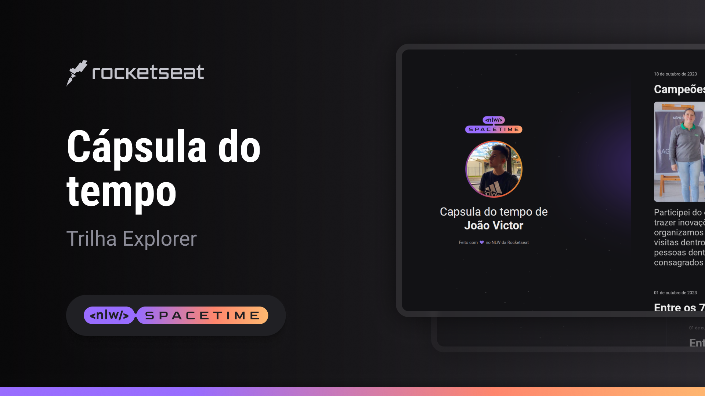

  

## 🖥️Projeto
Esse é um projeto Web Responsivo de uma capsula do tempo para exibir memórias em uma linha do tempo.

## 🚀Tecnologias
Esse projeto foi desenvolvido durante a NLW da Rocketseat com as seguintes tecnologias:
-HTML
-CSS
-Git e GitHub

## 🏷️Layout
Você pode vizualizar o layout do projeto através
[desse link](https://www.figma.com/file/UoYC9ovRkHaKD5AvTboCXq/Layout-Capsula-do-Tempo?type=design&t=IE3y5is7UzCyHhR5-0).
É necessário ter uma conta no [Figma](https://www.figma.com)